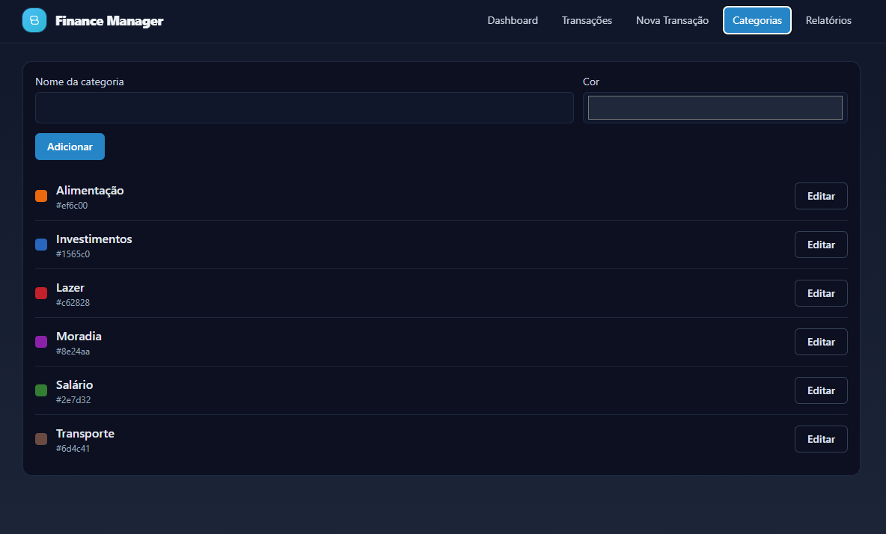

# Finance Manager

Aplicação de gestão financeira pessoal.

- Backend: PHP + MySQL (API REST simples)
- Frontend: React (Vite), @tanstack/react-query, Recharts, Sonner (toasts)
- Estilo: Tailwind CSS (componentes estilo shadcn-like)
- Funcionalidades: CRUD de categorias e transações (despesas/receitas), dashboard com totais, relatórios por categoria e período, marcação de despesas como pagas, projeções, exportação para PDF e CSV.

## Requisitos
- PHP 8+ com extensão PDO MySQL habilitada (pdo_mysql)
- MySQL 8+ (ou compatível)
- Node.js 18+

## Como rodar

### Backend (MySQL)
1. Configure variáveis de ambiente para o banco (Windows PowerShell):
   - Obrigatória: somente o nome do banco (`DB_NAME`). Os demais podem usar os padrões.
   ```powershell
   # Obrigatório
   $env:DB_NAME="finance_manager";

   # Exemplos (opcionais) — use apenas se precisar sobrescrever os padrões
   # Padrões: DB_HOST=127.0.0.1, DB_PORT=3306, DB_USER=root, DB_PASS=""
   # $env:DB_HOST="127.0.0.1";
   # $env:DB_PORT="3306";
   # $env:DB_USER="root";
   # $env:DB_PASS="";
   ```
   Se usar usuário/senha diferentes no seu MySQL, defina `DB_USER` e `DB_PASS` conforme necessário.

2. Inicie o servidor embutido do PHP:
   ```bash
   php -S localhost:8081 -t backend
   ```
   Observações:
   - O banco e as tabelas serão criados automaticamente se não existirem.
   - Certifique-se de ter a extensão pdo_mysql habilitada no PHP.
   - A API ficará disponível em `http://localhost:8081`.

3. Verifique rapidamente os endpoints (opcional):
   - Status API
     ```bash
     curl http://localhost:8081/
     ```
   - Timeseries (12 meses)
     ```bash
     curl "http://localhost:8081/reports/timeseries?months=12"
     ```
   - Transações paginadas
     ```bash
     curl "http://localhost:8081/transactions?page=1&page_size=5"
     ```

### Frontend
1. Instale dependências (inclui Tailwind, Recharts e React Query):
   ```bash
   cd frontend
   npm install
   npm run dev
   ```
2. Acesse http://localhost:5173

A API por padrão está em `http://localhost:8081`. Se mudar as portas, atualize `frontend/src/services/api.js`.

Observação (dev): se notar erro “Invalid hook call” no navegador, feche outras abas antigas da app, pare e reinicie o Vite com `--force` e limpe o cache otimizado (`node_modules/.vite`).

```powershell
# dentro de frontend/
if (Test-Path node_modules/.vite) { Remove-Item -Recurse -Force node_modules/.vite }
npm run dev -- --force
```

### Dicas de verificação rápida
- Dashboard
  - Verifique o card “Despesas pendentes” e a projeção no card “Totais”.
- Transações
  - Tente marcar/desmarcar uma despesa como paga (coluna “Pago”).
  - Filtre por Status: `Pendentes` e `Pagos`.
- API (pagamento rápido)
  - Exemplo de marcar transação `id=1` como paga via PATCH:
    ```bash
    curl -X PATCH -H "Content-Type: application/json" \
      -d '{"paid":1}' http://localhost:8081/transactions/1/paid
    ```

## Novidades recentes
- Dashboard
  - KPI “Despesas pendentes”: mostra apenas o total de despesas não pagas e tendência dos últimos 30 dias.
  - Card “Totais”: séries mensais (Receitas x Despesas x Saldo) a partir de `/reports/timeseries` e projeção de despesas baseada na média do período selecionado (6m/12m/24m).
- Transações
  - Marcar como pago: coluna “Pago” com checkbox; PATCH `/transactions/{id}/paid`.
  - Filtro de status: `Todos | Pendentes | Pagos` (envia `paid=0|1` no GET `/transactions`).
  - Paginação, ordenação e filtros no servidor (React Query para cache e refetch).
- Relatórios
  - Endpoint `/reports/timeseries` (mensal, com income/expense/balance).
  - Endpoint `/reports/timeseries-by-category` (mensal por categoria, top N, com filtro de tipo).

> Observação: a exportação CSV e o gráfico temporal por categoria podem ser evoluídos conforme necessidade (separador, BOM UTF-8, etc.).

### Estilo (Tailwind / shadcn-like)
- Tailwind está configurado (postcss/tailwind.config). Você pode migrar gradualmente os componentes do MUI para componentes com classes Tailwind ou introduzir uma lib shadcn/ui conforme preferir.

## Estrutura
```
finance-manager/
  backend/
    index.php        # Roteador + endpoints
    db.php           # Conexão MySQL (PDO) e bootstrap do schema
  frontend/
    index.html
    vite.config.js
    package.json
    postcss.config.js
    tailwind.config.js
    src/
      main.jsx
      App.jsx
      services/api.js
      components/
        Dashboard.jsx
        TransactionsTable.jsx
        TransactionForm.jsx
        CategoryManager.jsx
        Reports.jsx
        ExportButtons.jsx
      styles.css
```

## Endpoints principais
- GET    /categories
- POST   /categories
- PUT    /categories/{id}
- DELETE /categories/{id}

- GET    /transactions
  - Parâmetros de filtro: `date_from`, `date_to`, `category_id`, `type`, `q`, `paid`
  - Paginação: `page`, `page_size` (1–100)
  - Ordenação: `sort_by` (date|amount|id), `sort_dir` (asc|desc)
  - Resposta paginada: `{ data, pagination }` quando `page > 0`; caso contrário, array simples
- POST   /transactions (campos: type, amount, date, description?, category_id?, paid?)
- PUT    /transactions/{id} (atualiza campos, inclusive `paid`)
- PATCH  /transactions/{id}/paid (payload: `{ paid: 0|1 }`)
- DELETE /transactions/{id}

- GET    /reports/summary?date_from&date_to
- GET    /reports/timeseries?months=12&date_from=&date_to=
- GET    /reports/timeseries-by-category?months=12&type=expense|income&top=5

## Exportações
- PDF: gerado no frontend com `jspdf` e `jspdf-autotable`.
- CSV: gerado no frontend e baixado pelo navegador.

## Observações
- Este projeto é educativo e simples; ajuste conforme suas necessidades (auth, validações avançadas, etc.).

## Capturas de tela
Coloque imagens da aplicação no diretório `screenshots/` para que novos usuários vejam o sistema em funcionamento.

Imagens sugeridas (substitua pelos seus arquivos):

```
screenshots/
  dashboard.png
  transactions.png
  transaction_form.png
  categories.png
  reports.png
```

Evidências no README:





Como gerar:
- Abra o app (Vite) e navegue até cada tela.
- Use uma ferramenta de captura (Windows: Win+Shift+S) e salve o arquivo em `screenshots/` com o nome acima.
- Evite informações sensíveis nos prints (dados reais). Se preciso, crie alguns registros de teste.
